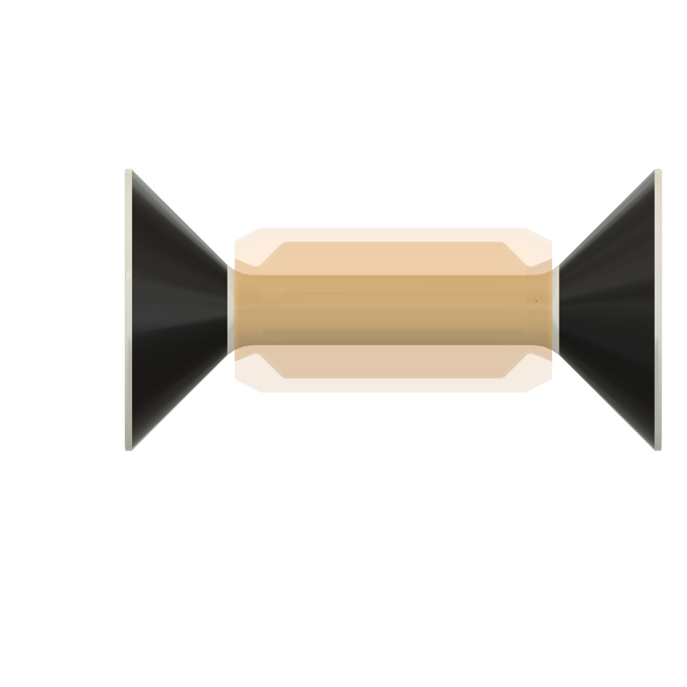
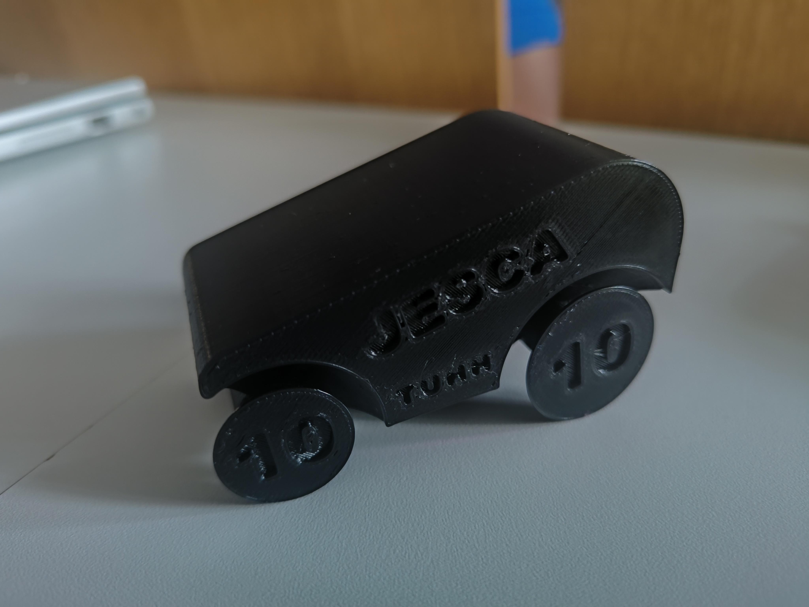
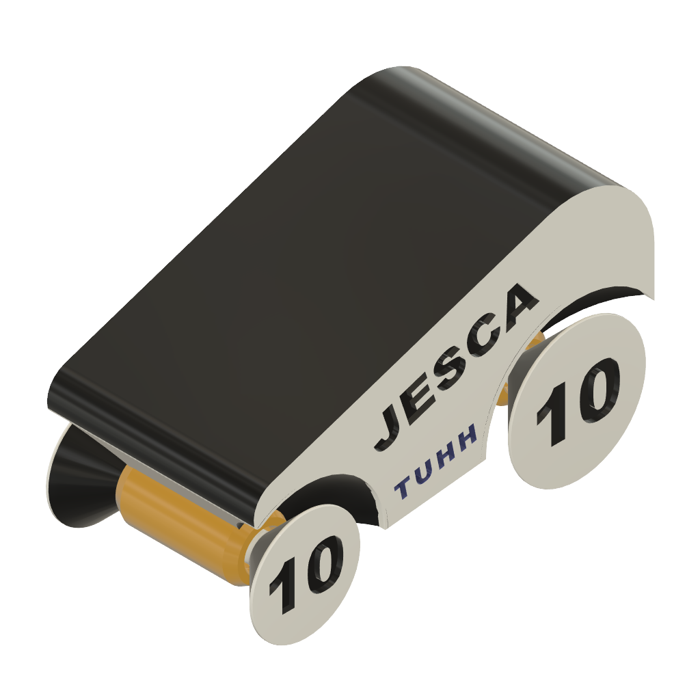
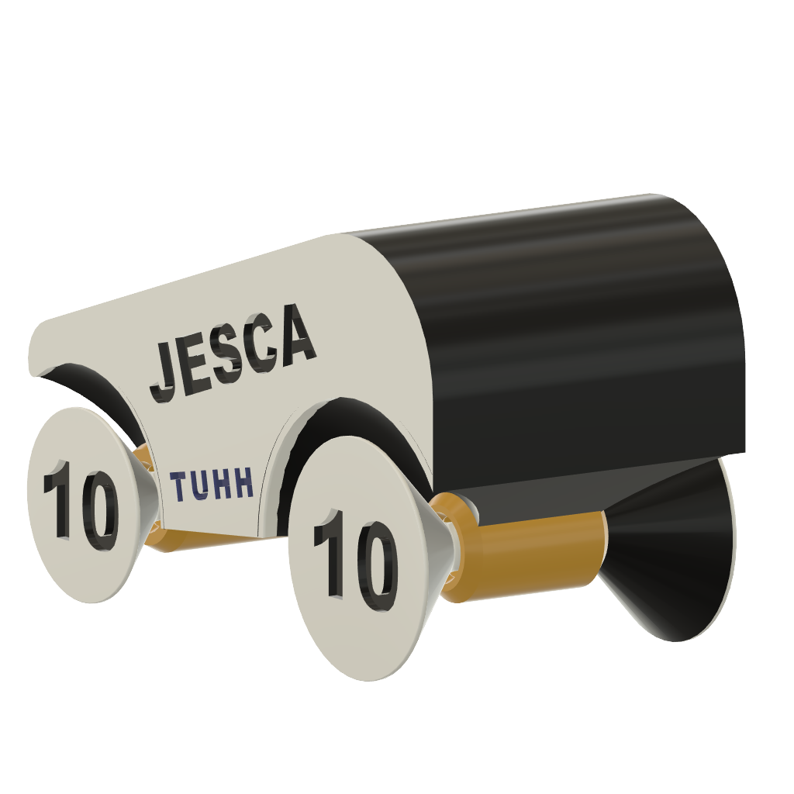
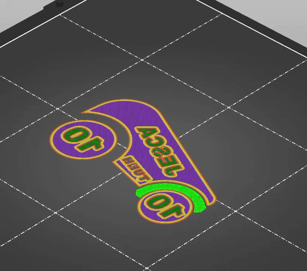
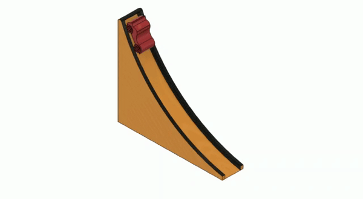
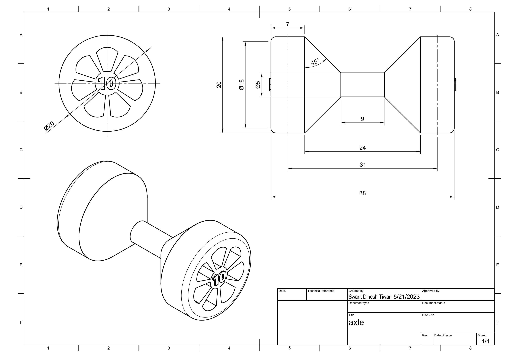
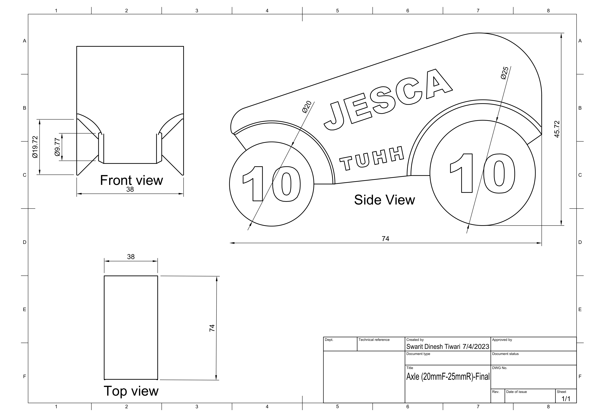

# JESCA — Single-Print Movable Mini Car

A fully functional miniature race car designed and manufactured as a **single printed part** — no assembly, no hardware, no post-print joining. Designed for an Additive Production seminar race championship where cars were released down a curved ramp and scored by distance traveled relative to print weight.

**Team:** JESCA (5 members) | **Tools:** Fusion 360, SolidWorks | **Printer:** Prusa MINI+ | **Year:** 2023

---

## Challenge

Design a movable miniature car that:
- Is printed as **one single part** — no assembly allowed
- Fits within **75 × 40 × 50 mm**
- Weighs at least **10 g**
- Has all four wheels rotating freely after printing
- Scores highest on: **Car Performance = Distance (m) ÷ Print weight (g)**

The scoring formula made weight optimization just as critical as aerodynamics and rolling performance. A lighter car that rolls the same distance outscores a heavier one.

---

## The Core Engineering Problem

Making wheels that rotate freely inside a single-print part requires solving three problems simultaneously:

**1. Clearance between axle and wheel bore** — tight enough to keep wheels aligned, loose enough to rotate without friction locking after cooling and shrinkage.

**2. Wheel retention** — no snap-fits, no screws, no clips. The axle geometry itself must prevent the wheels from sliding off.

**3. Printability** — the clearance gaps between moving parts must survive the print process without fusing. Layer adhesion across a 0.28 mm gap behaves differently at different orientations.

---

## Axle Design

The axle is the critical component. Before the final car was printed, an **axle test phase** was conducted — up to 5 different axle designs were printed and evaluated within a 40 × 40 × 40 mm design space to find the optimal clearance and geometry.

The final axle uses a **conical flange design**: the wheel disc sits inside a tapered collar that widens outward, keeping the wheel captured on the axle without any additional hardware.

| Parameter | Front axle | Rear axle |
|-----------|-----------|-----------|
| Wheel diameter | Ø 20 mm | Ø 25 mm |
| Shaft diameter | Ø 20 mm | Ø 25 mm |
| Bore diameter | Ø 19.72 mm | — |
| Radial clearance | 0.28 mm | — |

The 0.28 mm radial clearance was selected based on axle test results to allow free rotation while minimising lateral wobble.

*Isolated axle render — conical flanges retain wheels without hardware*

---

## Printed Car

*The final printed JESCA car — single black PLA part, photographed on championship day. Layer lines visible on the body, "JESCA" and group number "10" embossed directly into the geometry. The gap between wheel and body is the 0.28 mm clearance that allows free rotation.*

---

## CAD Renders

*Full assembly — body, wheels, and axles as a single unified geometry. "10" embedded in wheel face = team group number*

*Rear view — front axle and wheel clearance gap visible*

---

## Print Strategy

### Orientation

The car was printed lying on its **X axis** — the axle runs parallel to the print bed. This was a deliberate DfAM decision:

- Axle cross-section prints as a continuous perimeter loop at each layer, giving full circumferential strength
- Clearance gaps between axle and wheel bore are maintained consistently layer by layer
- Avoids printing the axle vertically, which would place wheel loads against the weakest direction (between layers)

### Slicer Preview

*Prusa Slicer preview showing print orientation and layer structure — wheel clearance zones visible in green*

### Print Parameters

| Parameter | Value |
|-----------|-------|
| Printer | Prusa MINI+ |
| Layer height | 0.20 mm (Quality) |
| Infill pattern | Gyroid |
| Infill density | ≤ 15% |
| Supports | Added where needed |
| Print time | 1 h 26 min |

Gyroid infill at 15% was chosen for its isotropic strength properties — it distributes load evenly in all directions while keeping weight low, directly improving the performance score.

---

## Race Challenge

*Championship ramp — 260 mm run, 300 mm drop. Cars released from the top, scored by distance divided by total print weight (car + supports)*

The ramp geometry meant the car needed to handle both the initial acceleration on the curved section and maintain momentum across a flat surface. Rolling resistance (axle friction, wheel alignment) directly affected final distance.

---

## DfAM Principles Applied

| Principle | How it was applied |
|-----------|-------------------|
| Single-part design | Wheels, axles, and body unified into one printable geometry |
| Clearance engineering | 0.28 mm radial gap — calibrated through test prints |
| Print orientation | X-axis orientation for axle strength and gap consistency |
| Lightweight structure | Gyroid infill at ≤15% to minimise print weight |
| Embedded geometry | Group number "10" embossed directly into wheel face |
| Iterative testing | Axle test phase before committing to final car design |

---

## Engineering Drawings

*Final axle technical drawing — front, side and top views with tolerances (Ø19.72 bore vs Ø20 shaft = 0.28 mm radial clearance)*

*Car body technical drawing — overall dimensions within the 75 × 40 × 50 mm design space constraint*

Full PDF drawings available in the `drawings/` folder.

---

## Files

- `car_assembly.step` — Full single-part CAD model
- `drawings/axle_drawing.pdf` — Final axle technical drawing with dimensions and tolerances
- `drawings/car_drawing.pdf` — Car body technical drawing
- `images/slicer_preview.gif` — Prusa Slicer layer preview animation
- `images/ramp_animation.gif` — Championship ramp simulation

---

## Team

JESCA — a team of 5 M.Sc. Mechanical Engineering students. Team name formed from the initials of all five members.

## License

MIT License
